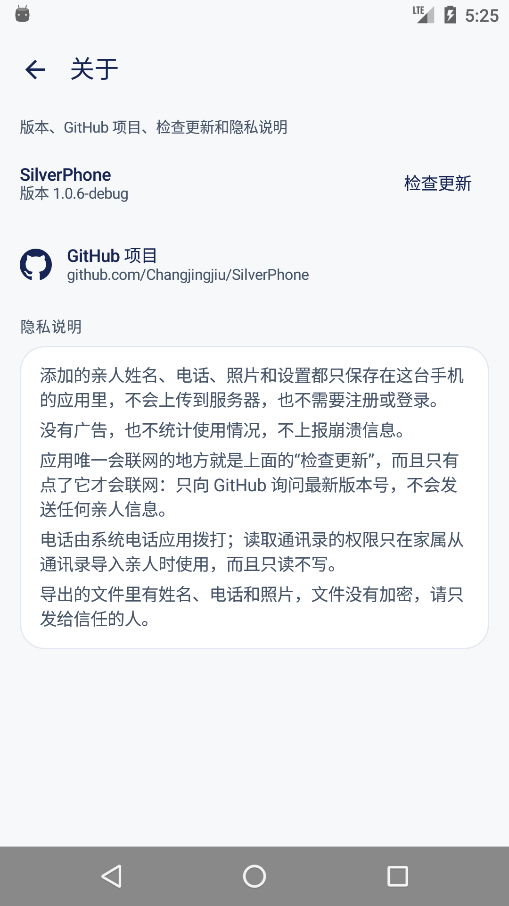
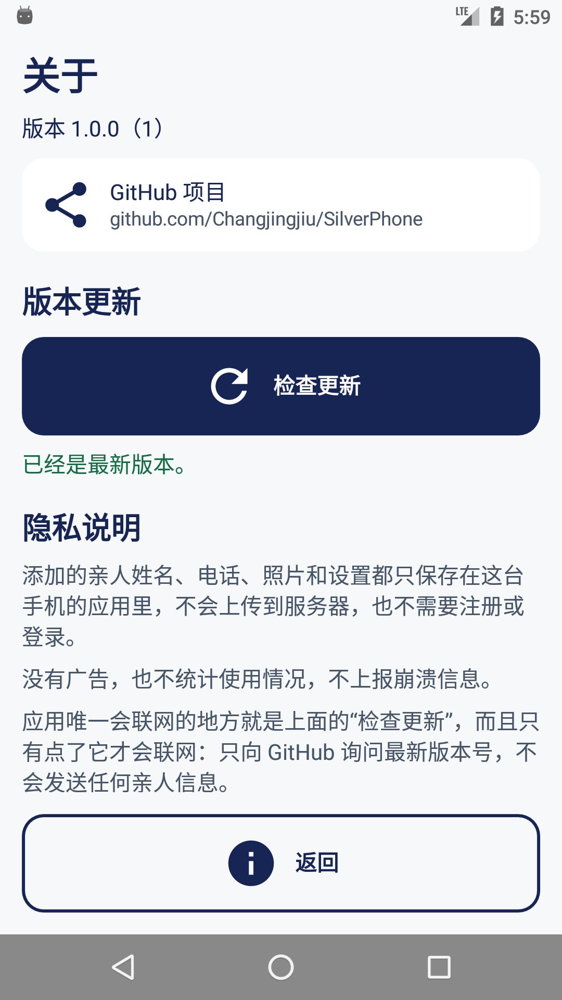

<div align="center">

**English** · [简体中文](README.md)


# SilverPhone

**One press on the green button under a relative's photo places an ordinary phone call.**

<p>
  <a href="https://github.com/Changjingjiu/SilverPhone/releases/latest"></a>
  
  <a href="https://github.com/Changjingjiu/SilverPhone/actions/workflows/android.yml"></a>
  <a href="LICENSE"></a>
</p>

<p>
  <a href="https://github.com/Changjingjiu/SilverPhone/releases/latest"><strong>Download for Android</strong></a> ·
  <a href="#setting-it-up-once">Getting started</a> ·
  <a href="https://github.com/Changjingjiu/SilverPhone/releases">Changelog</a> ·
  <a href="https://github.com/Changjingjiu/SilverPhone/issues">Report an issue</a>
</p>

</div>

This is an Android app with exactly one job. It is not a contacts app, not a dialer
replacement, and not a communication platform: it is the shortest possible path from
"I want to talk to my daughter" to a ringing phone. A family member sets it up once —
photo, name, number — and the person using it only ever has to recognise a face and
press one button.

The app was built against four specification documents (`00`–`04` in the project root)
that fix the interface flow, the logic, the features, the technology, and the
accessibility rules. Where this README describes a decision that departs from those
documents, [IMPLEMENTATION-NOTES.md](IMPLEMENTATION-NOTES.md) records what was decided
and why, and [acceptance-results.md](acceptance-results.md) records what each review
round found and fixed.

## What it does

- **The green button dials, and nothing else does.** The photo and the name on a card
  are deliberately inert. The photo is the largest thing on a card, and a whole-card
  target meant a resting hand, or a scroll that ended on a card, could place a call.
- **Nothing else is on the home screen.** No counters, no menus, no numbers. The family
  entry sits at the trailing edge of the title row, which is where a settings action
  lives in every other app.
- **The permission is asked for at the moment it is needed.** Pressing Call without the
  phone permission raises the system dialog on the spot, and the call goes through as
  soon as it is granted. Sending someone to a help page to read where to tap and then
  tap again was the worst detour in an earlier version.
- **Text sizes the family can raise.** Four presets from standard to very large, applied
  to the whole app, shown on a live card preview before saving. The standard preset is
  the ordinary Android scale; the larger ones are there when they are needed.
- **English or Chinese, and any country's dialling code.** Both are settings, both take
  effect immediately, and neither rewrites the numbers the family typed.
- **Everything can be copied to a second phone.** One file carries names, numbers,
  ordering and photos. Import it on another phone and the same app appears there, ready
  for another elderly user.
- **The version, the project and the promises sit on one screen.** Family settings →
  About shows the installed version, the GitHub address as text that can be tapped, a
  manual update check, and the privacy policy this app actually implements.
- **No account, no analytics, no ads, and no server of its own.** Everything the family
  types stays on the phone. The only request the app can make is the update check on the
  About screen, which runs when a family member taps it and sends nothing about the
  contacts, the photos or the phone.

## Setting it up, once

1. Install the app and open it. With no contacts yet, the home screen says
   "Ask a family member to add someone" and offers one button.
2. **Family settings → Manage contacts → Add a contact.** Give a photo, the name the
   elderly user will see and hear, and the phone number. Repeat per relative.
   You can also bring people in from this phone's address book, or from a file another
   phone exported.
3. **Family settings → Calling permission** and allow calls. From then on a single
   press on a green button dials.
4. **Family settings → Text size** if the standard size is not comfortable. The preview
   card changes as you choose, and your choice applies to the whole app.
5. **Family settings → Language & dialling code** if the phone is used outside mainland
   China: set the prefix (for example `+1`), or choose "add nothing" if every number is
   already stored with its own prefix. A number written with a leading zero — a landline
   such as `01012345678` — has that zero dropped when the code is added, because the zero
   is the domestic trunk prefix the code exists to replace: it is dialled as
   `+86 10 1234 5678`.
6. Call yourself once from the relative's card to confirm that the call connects and
   that the system phone screen returns to the app when it ends.
7. Put the app icon in a fixed place on the home screen and teach it as one sentence:
   "open the bright phone icon, look at the photo, press the green button."

Dual-SIM phones are handled by the system, which asks which SIM to use or follows the
default voice SIM that the family sets in Android's own settings. The app deliberately
does not duplicate that setting, because it cannot see vendor-specific SIM APIs.

## Moving everyone to a second phone

**Export.** Family settings → Import or export → Export contacts. The screen states how
many relatives and photos will be included, and warns that the file contains their names,
numbers and faces, so it should only be sent to someone trusted. The result is an ordinary
**unencrypted** ZIP named `SilverPhone_联系人_YYYYMMDD_HHmmss.zip` holding `manifest.json` and one
`photos/<uuid>.jpg` per relative. You can save it or hand it to any sharing app; the app
cannot tell whether it arrived.

**Import.** The same screen → Import from a file. The file is fully checked before any
preview is shown, and the default mode is *add the people in this file and keep the ones
already here*; someone already present - same id or same number - keeps this phone's name,
photo and position. The alternative is *replace every relative on this phone*, which raises
a confirmation naming how many will be deleted and how many will arrive, and offers to
export the current list first. A failure anywhere rolls the whole import back: you see
either the complete old list or the complete new one, never a half-imported mixture.

The text size is deliberately **not** imported. It is this phone's setting for this person,
not part of the contact data.

## The screens

| Home | Manage contacts | Add a relative |
|:---:|:---:|:---:|
|  |  |  |
| The whole app for the elderly user: photos and a green Call button. | For the family: reorder, edit, delete, search by name or number. | Photo, the name the elderly user will see, and the number. |

| Family settings | Import or export | Text size |
|:---:|:---:|:---:|
|  |  |  |
| Seven entries in a fixed order, each with one line of explanation. About is the last of them. | Reading a file and writing one are two ends of the same job, so they share one entry. | The preview is pinned, so the button row can never slice it in half. |

| Language & dialling code | Call permission | How to use |
|:---:|:---:|:---:|
|  |  |  |
| Each language is named in its own language; the code field previews the number it will dial. | Asked for at the moment of the press, never on a separate page. | What the app does, and what the system phone screen controls instead. |

| About | After a check |
|:---:|:---:|
|  |  |
| Version, the GitHub address as text that can be tapped, the update check, and the privacy statement. | What "Check for updates" answers on a phone that already has the newest release. |

**About** (the last entry in family settings) carries the four things a family member
asks about once the app is working: which version is installed, where the project lives,
whether a newer release exists, and what the app does with their data. The version comes
from the installed build itself, so it cannot disagree with what was installed. The
address is shown as text and opens in the browser. "Check for updates" is the only thing
in the app that touches the network, and only when it is tapped.

The rest, including the English interface:
[`design/screenshots/`](design/screenshots).

## Back behaviour

Every screen that can be left has its own visible Back control, and the system back key
does the same thing, so the two can never disagree. Leaving the home screen with system
back exits the app rather than dropping the user onto the phone's launcher, which looks
like a crash.

| Screen | Its own control | System back goes to |
|---|---|---|
| Home | none needed (the root) | the phone's home screen |
| Family settings | 返回打电话 / Back to calls | the home screen |
| Manage contacts | 返回 / Back | family settings |
| Add or edit a relative | 取消 / Cancel, with a confirmation if there are unsaved edits | manage contacts |
| Crop photo | 取消 / Cancel | back into the form, keeping what was typed |
| Import from this phone | 取消 / Cancel | family settings |
| Import or export | 返回 / Back | family settings |
| Import from a file | 返回 / Back | family settings |
| Export contacts | 返回 / Back | family settings |
| Text size | 取消 / Cancel | family settings |
| Language & dialling code | 取消 / Cancel | family settings |
| Calling permission & how to use | 返回 / Back | family settings |
| About | 返回 / Back | family settings |
| Dial help (permission or system failure) | 返回首页 / Back to calls | closes the help and returns home |

## Build and install

Requirements: JDK 17, and an Android SDK with platform 36 and build-tools 36.1.0.

```bash
export JAVA_HOME=$(/usr/libexec/java_home -v 17)
export ANDROID_HOME=$HOME/Library/Android/sdk

./gradlew assembleDebug              # debug APK
./gradlew installDebug               # install on the attached device
./gradlew testDebugUnitTest          # 104 unit tests, no device needed
./gradlew connectedDebugAndroidTest  # 51 tests on a device or emulator
./gradlew lintDebug
```

| Build | Path | Notes |
|---|---|---|
| debug | `app/build/outputs/apk/debug/app-debug.apk` | package `com.silverphone.app.debug`, installs alongside the release build |
| release | `app/build/outputs/apk/release/app-release.apk` | R8 shrinking and resource shrinking enabled |

**There is no production signing key in this repository.** The release build is signed
with the debug key, so it is a test build and not something to publish. Replace the
`signingConfig` in `app/build.gradle.kts` before a real release.

You do not have to build anything to install it: CI builds every tagged version and
publishes it at <https://github.com/Changjingjiu/SilverPhone/releases>. One version, one
file — `SilverPhone-vX.Y.Z.apk` — and that page is also where the About screen's update
check sends a family member. Debug builds are not published there; they stay in Actions as
build artifacts for development.

Those published APKs are signed with the debug key: installing one over a build signed
with a different key fails with `INSTALL_FAILED_UPDATE_INCOMPATIBLE`, so the older build
has to be uninstalled first — and that deletes the contacts stored in it, so export before
updating. The steps are in [docs/RELEASING.md](docs/RELEASING.md).

`minSdk` is 23 (Android 6.0) and must not be raised: the product contract fixes it.
`build-matrix.md` records which dependency versions are held back and why — several
otherwise-current AndroidX releases declare a higher `minSdk` or demand a newer
`compileSdk`, and each one was checked against its published AAR metadata rather than
its release notes.

## How it works

The interesting parts are the ones where the easier implementation would have been wrong.

**One press produces exactly one call.** An application-scoped `DialCoordinator` lives
for the life of the process. The screen reports a press; the coordinator decides whether
it becomes a call, latches for three seconds, and delivers the request through a
`Channel` to the foreground host, which may claim each request exactly once. A double
press, a configuration change, or a state collector that re-runs cannot produce a second
call, and a request that was already handed to the system is never replayed.

**The call is placed from the Activity.** `startActivity` with `ACTION_CALL` from an
application `Context` throws, and the app reported "the phone did not open" on real
devices while working perfectly in tests. `PhoneLauncher.launch` now takes a `Context`
that must be the foreground Activity, and its type says so.

**Time is measured monotonically.** The spacing rule between two calls subtracts
`SystemClock.elapsedRealtime` readings, so a clock change or a timezone jump cannot
block dialling.

**The exchange file is a contract, not a dump.** The archive is a ZIP holding a strictly
parsed JSON manifest and one JPEG per contact. Reading it refuses unknown fields,
unlisted entry names, nested paths, more than 501 entries, and anything beyond the
counted byte limits (80 MiB compressed, 70 MiB expanded, 1 MiB manifest, 128 KiB per
photo). Every photo is verified against its SHA-256 and byte count before anything is
written, so a corrupted or hand-edited file is rejected rather than half-imported, and
the whole import rolls back on failure.

**Photos are normalised on the way in.** Sampling happens on the shorter edge and is
bounded to four million decoded pixels; the crop is centred and square; the encode
ladder tries 512 px at quality 82, then 70, then 384, then 256, and never upscales. A
6000 × 4000 camera photo therefore becomes a 512 × 512 avatar whose resolution does not
depend on the aspect ratio it arrived with.

**Text size is applied exactly once.** A preset multiplies base `sp` values and the
result is resolved by Android through the system font scale. The system scale is never
overwritten and never applied twice, and the home screen's two-column decision is made
by measuring a four-character name at the current sizes rather than by checking the
screen's pixel width.

**The database moved forward without losing anything.** Version 2 added the language and
dialling-code columns through a real `MIGRATION_1_2` with defaults, not a destructive
rebuild: contacts, photos, ordering, and the text-size choice all survive an update.

## Data and privacy

The app declares three permissions: `CALL_PHONE`, `READ_CONTACTS` and `INTERNET`.
`CALL_PHONE` and `READ_CONTACTS` are requested at runtime, from the action that needs
them. `INTERNET` exists for exactly one thing: the "Check for updates" tap on the About
screen, which asks GitHub for the newest release tag and sends no name, number, photo or
anything else about the family. That request never runs on its own, nothing else in the
app can reach the network, and every other feature works with the phone in flight mode.

Contacts, photos and settings live in the app's own private database. The system address
book is read only when a family member chooses *Import from this phone's contacts*, and
only to show a picker; the app never modifies or deletes anything in it, and later
changes to the system address book do not silently change the cards. An export contains
exactly the names, numbers, ordering, placeholder colours and photos — never the system
address book wholesale, never the text size, never a permission state, and never anything
from another app. The export is a plain, **unencrypted** ZIP, and the export screen says
so.

## Accessibility

Built for someone who may not read, may not see well, and may not know the usual phone
conventions.

- Every screen that can be left has its **own Back control**, and system back does the
  same thing, so the two can never disagree.
- **Touch targets have a floor** that no text size can push below, and the call control
  is a wide, tall, distinctly coloured block rather than a small glyph.
- Choices are exposed as **radio options with a spoken label and a selected state**, not
  as a border thickness or a colour a screen reader cannot convey.
- Text is measured, never assumed: names wrap instead of being ellipsised, and every card
  in a row reserves the height of that row's tallest name so the row stays even.
- Animations are short (220 ms) and directional, so it is clear which way the app just
  moved. Nothing depends on an animation completing.

## Project layout

```
app/src/main/kotlin/com/silverphone/app/
├── app/            Application, container, the language rules
├── data/
│   ├── local/      Room entities, DAOs, the database and its migrations
│   └── repository/ the single write path for contacts, photos and settings
├── domain/         pure rules: phone numbers, names, country codes, the archive model
├── platform/
│   ├── phone/      the dial contract: coordinator, launcher, permission gate
│   ├── photos/     normalisation, encoding, loading
│   ├── transfer/   the archive writer and reader, the share gateway
│   ├── update/     the one network call: the GitHub release lookup
│   └── contacts/   the system address book as a source
└── ui/             one package per screen, plus theme and shared components
```

Around the module: the requirement documents `00`–`04` and the design specification
`05` that was derived from them, in [`docs/spec/`](docs/spec), the
release procedure in [`docs/RELEASING.md`](docs/RELEASING.md), the build and release
workflow in [`.github/workflows/`](.github/workflows), the generated sample archive in
`design/fixtures/`, and the screenshots in `design/screenshots/`.

`domain/` has no Android imports. Screens never touch the database and never place a
call; they render state and report events. That is what makes the dial contract testable
without a device, and it is why the dial failure described above could hide for as long
as it did: nothing in the unit tests could see the context the call was launched from.

## Tests

```bash
./gradlew testDebugUnitTest          # 104 unit tests
./gradlew connectedDebugAndroidTest  # 51 instrumented tests
```

The instrumented suite covers what only exists on a device: the home screen's dial
contract driven through the real Compose tree, the management screen's action bar, the
photo pipeline against real decoders, the archive round trip through real files, and the
repository against real SQLite. The launcher is always a recording double, so no
automated test can place a real call.

Test photos are generated, never photographed: nothing in this repository is a real
person's face.

## Out of scope

Deliberately not built: accounts, sync, a server of its own, cloud backup, analytics,
advertising or crash reporting; publishing to an app store; video calling; messaging;
multiple profiles; a call log; a dial pad; and calling from a lock screen or an overlay.
Together with the update check, nothing here downloads or installs anything: the About
screen opens the release page and stops there.

## License

[MIT](LICENSE). Third-party dependency licenses, including the one drawable copied from
Google's Material Design icons, are listed in
[THIRD_PARTY_NOTICES.md](THIRD_PARTY_NOTICES.md).

## Contributing

Issues and pull requests are welcome. Two house rules, because they are what keeps the
app honest for the person holding it:

1. **Nothing dials except the Call button**, and no automated test may place a real call.
2. **The network has one job.** The single permitted request is the update check, and it
   has to stay manual, anonymous and optional: one `GET` to the GitHub releases API, no
   telemetry, no background work. A feature that needs a server belongs in a different
   app.

Please run both test suites before opening a pull request, and if you touch a screen,
check it at the largest text preset as well as the standard one.
