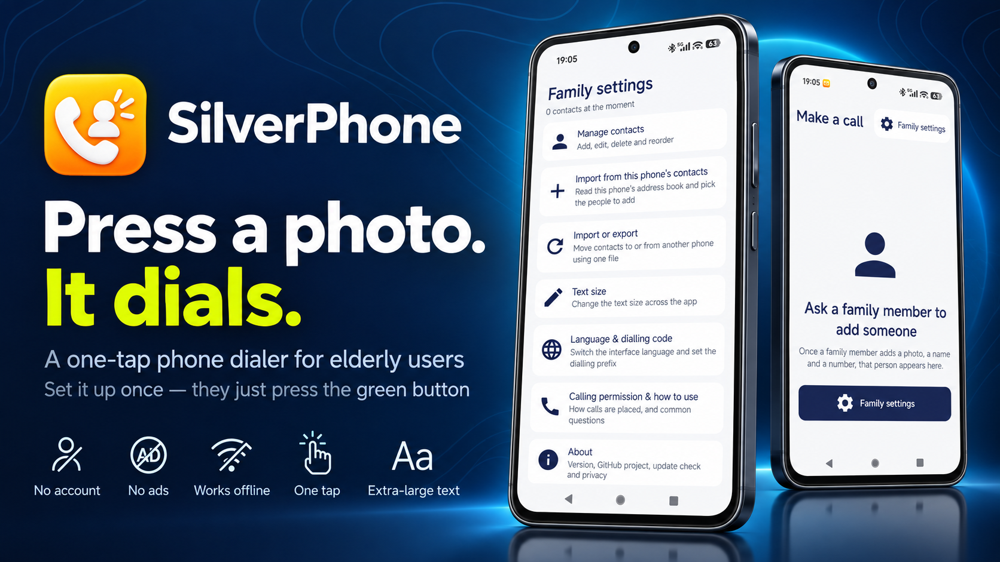
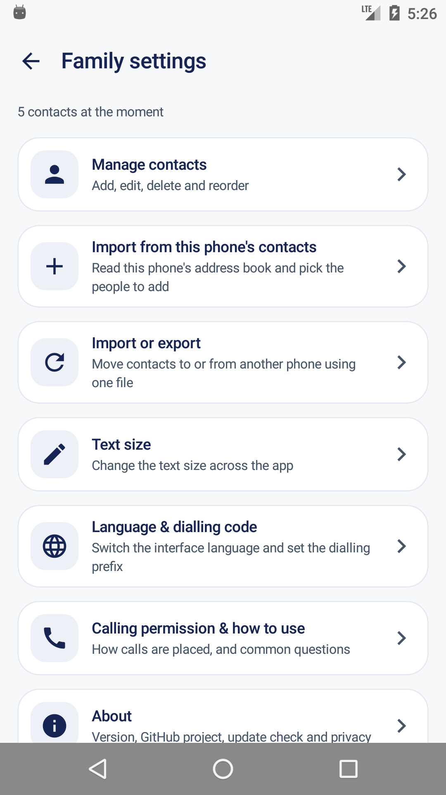
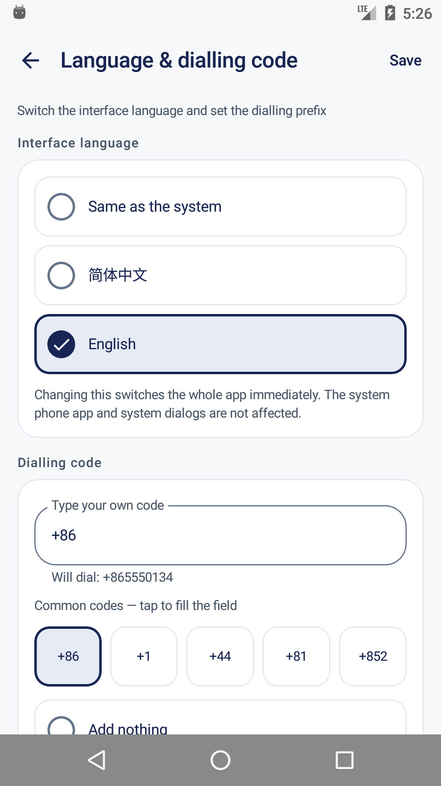
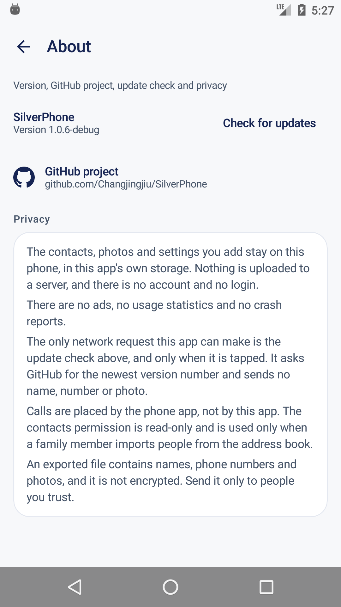

<div align="center">

**English** · [简体中文](README.zh-CN.md)



# SilverPhone

**A one-tap phone dialer for elderly users.** A family member adds a photo, a name and a number; the person using it presses one green button.

<p>
  <a href="https://github.com/Changjingjiu/SilverPhone/releases/latest"></a>
  
  <a href="https://github.com/Changjingjiu/SilverPhone/actions/workflows/android.yml"></a>
  <a href="LICENSE"></a>
</p>

<p>
  <a href="https://github.com/Changjingjiu/SilverPhone/releases/latest"><strong>Download for Android</strong></a> ·
  <a href="#getting-started">Getting started</a> ·
  <a href="https://github.com/Changjingjiu/SilverPhone/releases">Changelog</a> ·
  <a href="https://github.com/Changjingjiu/SilverPhone/issues">Report an issue</a>
</p>

</div>

## Features

- **Only the green button dials.** The photo and the name on a card are not tappable, so a resting hand or a scroll that ends on a card cannot place a call.
- **Nothing else on the home screen.** No counters, no menus, no call log.
- **The call permission is asked for at the moment it is needed**, and the call goes through as soon as it is granted.
- **Four text sizes** for the whole app, with a real card preview before saving.
- **English or Chinese**, and any country's dialling code.
- **One file moves everyone to a second phone** — names, numbers, order and photos — and the receiving phone previews the file before it imports anything.
- **Press and hold a card to delete several relatives at once**, with a confirmation that names how many will go.
- **Two apps in one.** The call screen is built around the person using it; every family screen is an ordinary Android app, with a compact bar, one-line rows and no oversized buttons.
- **Adapts to the screen it is on.** On a phone the family menu opens one screen at a time; on a tablet or a foldable the menu stays beside the screen it opened (Material 3 `ListDetailPaneScaffold`, window size classes rather than device checks).
- **Every tap answers back**: pressed controls darken, shrink and spring, with a short tick.
- **One design, not several.** Six roles of text, four corner sizes, one palette, one spacing scale, one weight per role — and the same gestures everywhere: tap a row to open it, press and hold to select, destructive actions always ask first, Save always in the same corner.
- **No account, no ads, no analytics.** The app's only network request is the manual "check for updates".

## Getting started

Download the APK from [Releases](https://github.com/Changjingjiu/SilverPhone/releases/latest), or build it.

**Coming from v1.0.1 or earlier: uninstall the app first.** Those builds were signed
with a different key and Android will refuse to install over them. Uninstalling deletes
the contacts stored in the app, so export them from *Family settings → Import or export*
beforehand and import the file again afterwards. From v1.0.2 on, updates install normally.

```bash
# needs JDK 17 and Android SDK 36
./gradlew assembleDebug
./gradlew installDebug
```

Then, on the phone:

1. Open the app and tap **Family settings**.
2. **Manage contacts → Add a contact**: pick a photo, type the name the elderly user will see and hear, and the phone number. Repeat for each relative.
3. **Calling permission** if you want to allow calls up front. This step is optional: pressing a green button without the permission asks for it on the spot.
4. **Text size** if the standard size is not comfortable.
5. **Language & dialling code** if the phone is used outside mainland China.
6. Call yourself once from a relative's card to check it works, then put the icon in a fixed place on the home screen.

## Preview

| Home | Family settings | Add a relative |
|:---:|:---:|:---:|
|  |  |  |
| The whole app for the elderly user. | For the family: contacts, import, export, text size, language, permission. | Photo, the name the elderly user sees, and the number. |

| Language & dialling code | Call permission | About |
|:---:|:---:|:---:|
|  |  |  |
| Live preview of the number that will be dialled. | Asked for where it is needed; this page explains and grants it. | Version, project links, update check, privacy. |

More screens, both languages, in [`design/screenshots/`](design/screenshots).

## Why SilverPhone

- **It works for someone who cannot read.** A face and one green button. The name is there to be recognised, or read aloud by a screen reader.
- **Large text that does not break the layout.** Names wrap instead of being truncated, cards in a row stay level, and touch targets never shrink below 56 dp.
- **It uses the phone's own dialler.** Dual SIM, call waiting, speakerphone, the call log: all of it behaves exactly as it does for any other call.
- **The same list can be handed to a second phone**, so two elderly parents can each have one.
- **No account and no server.** Contacts, photos and settings stay in the app's private storage.
- **Small and current**: 2.7 MB, Android 6.0 (API 23) and up, and the interface follows Material 3's shape, type and motion guidance.

## Reference and scope

| | |
|---|---|
| Requirements | Android 6.0+ (API 23). No Google services, no account. |
| Permissions | `CALL_PHONE`, `READ_CONTACTS` — each asked for at the moment it is used — and `INTERNET`, used only by the manual update check. |
| Build | JDK 17 and Android SDK 36. `./gradlew assembleDebug` |
| Tests | `./gradlew testDebugUnitTest` (104) · `./gradlew connectedDebugAndroidTest` (57) |
| Documents | [docs/spec](docs/spec) — the four specification documents · [IMPLEMENTATION-NOTES.md](IMPLEMENTATION-NOTES.md) · [acceptance-results.md](acceptance-results.md) · [build-matrix.md](build-matrix.md) · [docs/RELEASING.md](docs/RELEASING.md) · [THIRD_PARTY_NOTICES.md](THIRD_PARTY_NOTICES.md) |

**Not built on purpose:** accounts, sync, servers, cloud backup, analytics, ads, crash reporting; app-store publishing; video calls; messaging; multiple profiles; a call log; a dial pad; calling from the lock screen.

**Known limits:** the import preview holds an archive's photos in memory, so a very large archive on a low-memory phone can fail — nothing is written until the import commits, so a failure means starting the import again. Releases are signed with the SilverPhone release key; the certificate's SHA-256 is in [docs/RELEASING.md](docs/RELEASING.md) if you want to check a download.

## License

MIT — free to use, modify and distribute. See [LICENSE](LICENSE).
