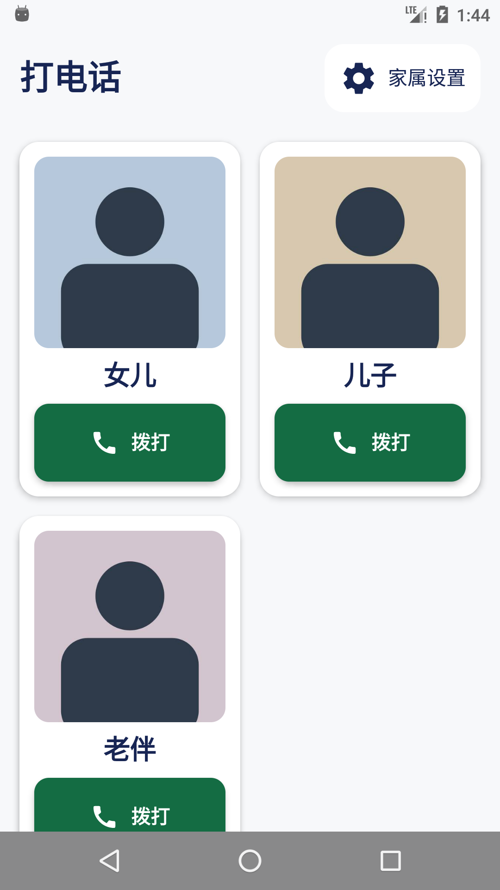
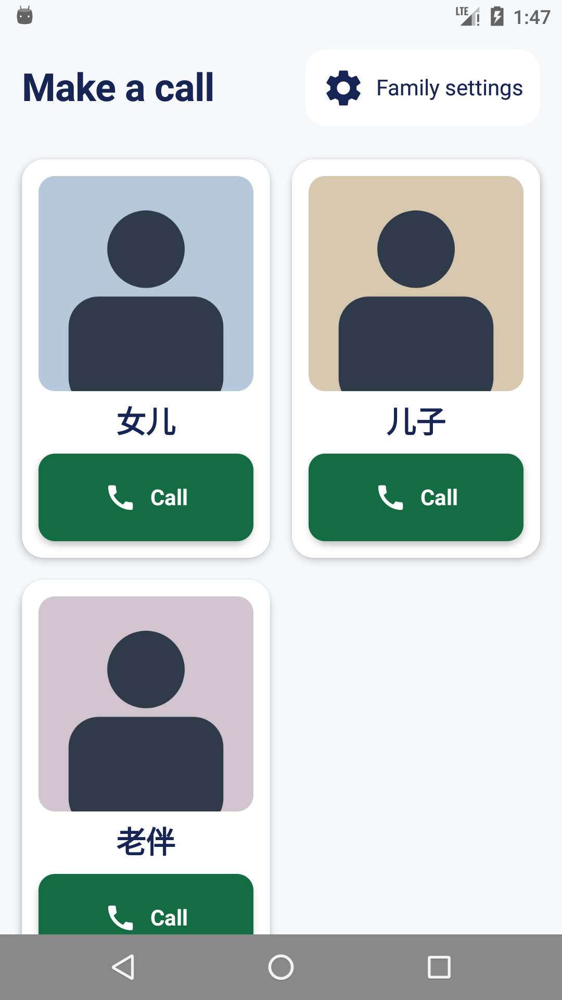
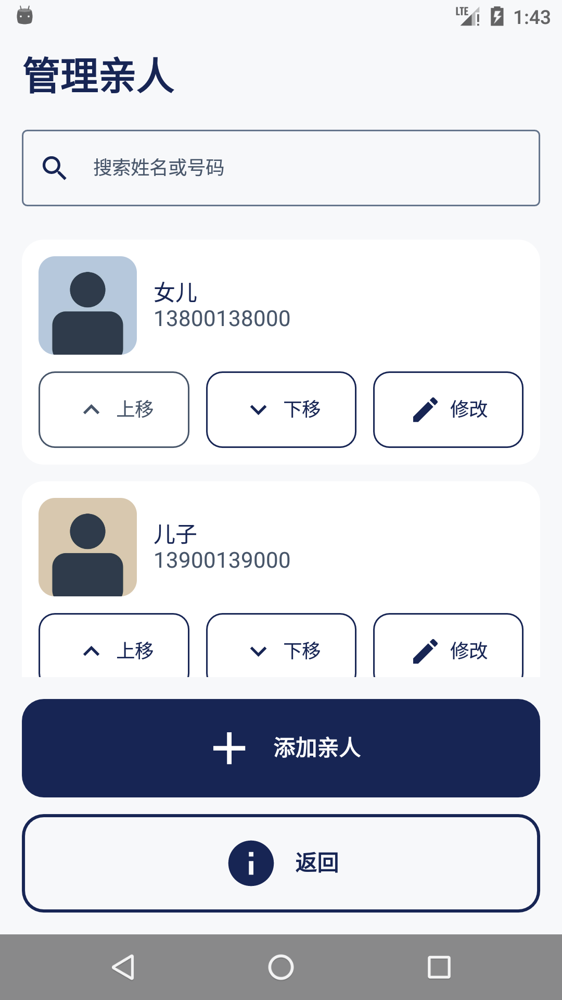
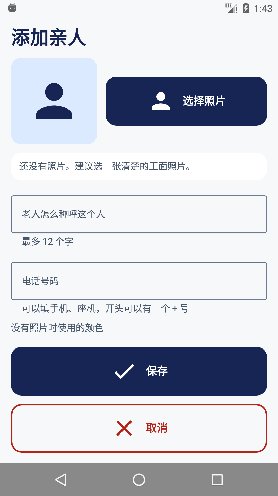
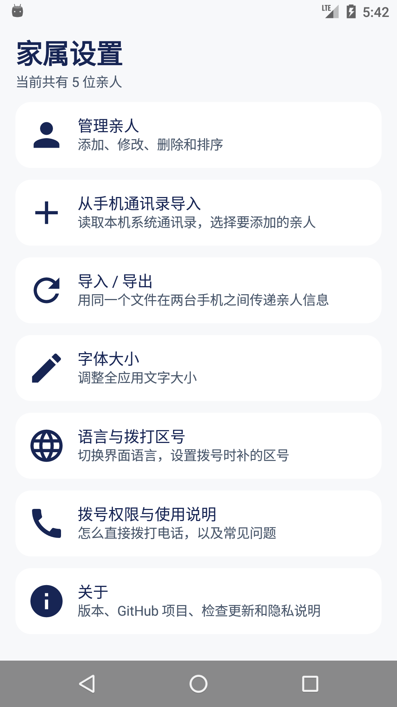
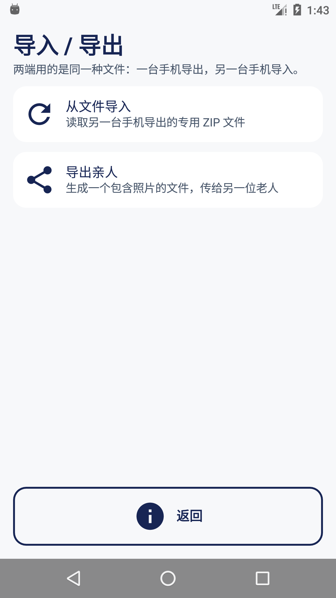
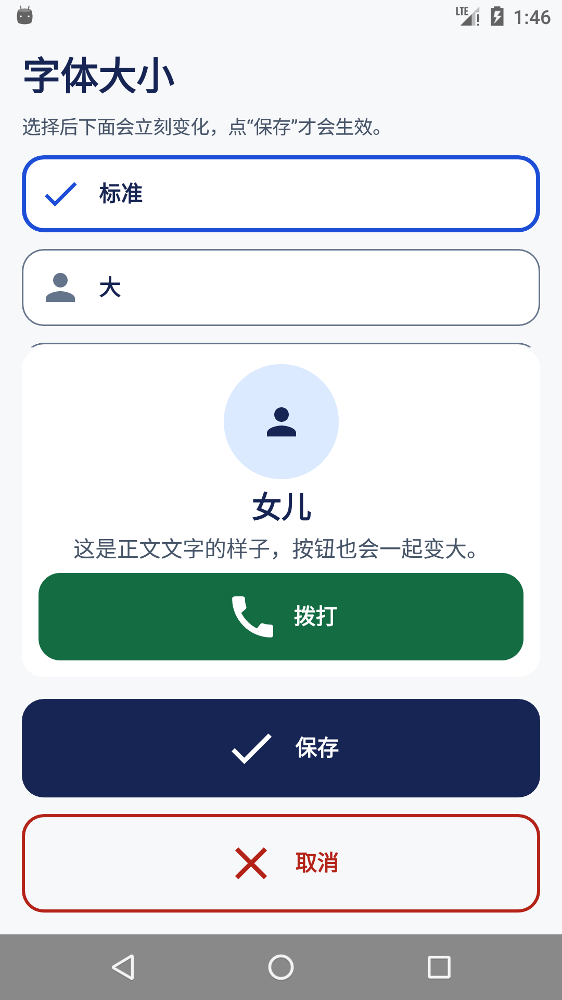
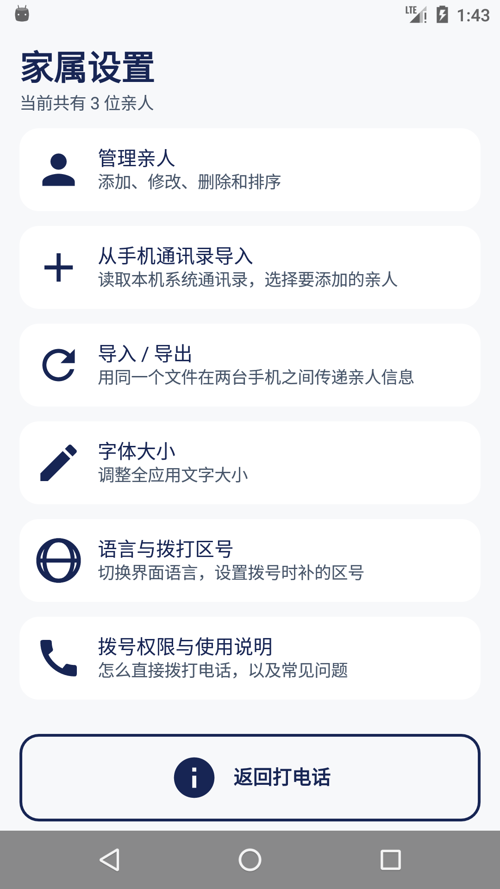
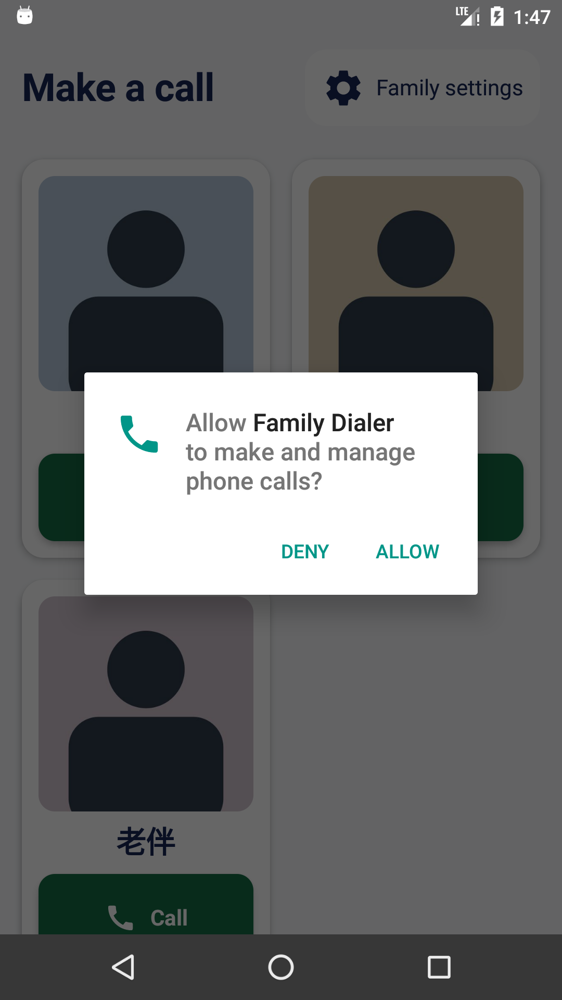
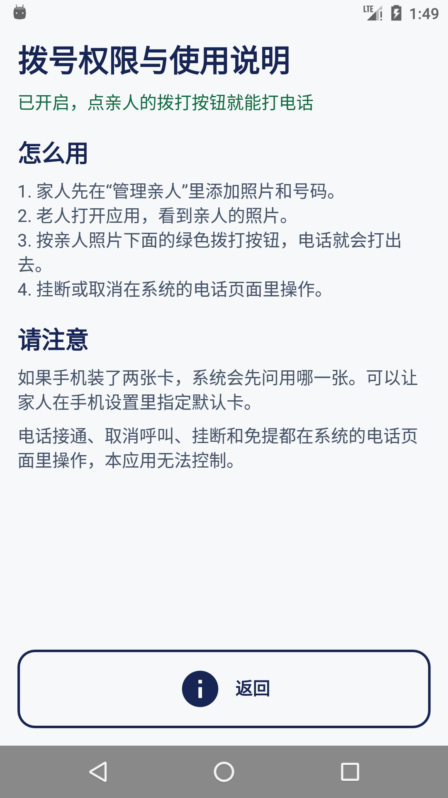

<div align="center">

[English](README.md) · **简体中文**




# SilverPhone

**点一下亲人照片下面的绿色按钮，电话就拨出去了。**

</div>

这是一个只干一件事的 Android 应用。它不是通讯录，不是系统拨号器的替代品，也不是聊天工具——
它只负责把「我想跟女儿说句话」变成一通正在响铃的电话，中间越短越好。家属配置一次：照片、
称呼、号码。之后老人只需要认出一张脸，按一个按钮。

工程按项目根目录的四份设计文档（`00`～`04`）实现，它们分别定下了界面流程、软件逻辑、
功能范围、技术栈和无障碍要求。本文件凡是和那四份文档不一致的地方，都记在
[IMPLEMENTATION-NOTES.md](IMPLEMENTATION-NOTES.md) 里，写明决定了什么、为什么；
每轮检查发现并修好了什么，记在 [acceptance-results.md](acceptance-results.md)。

## 几个刻意的取舍

- **只有绿色按钮会拨号。** 卡片上的照片和名字都不响应点击。照片是卡片上最大的一块，
  整张卡片都能点，就意味着搭上去的手、或者一次刚好停在卡片上的滑动，都可能把电话拨出去。
- **首页上不放别的东西。** 没有计数、没有菜单、没有号码。家属设置的入口放在标题行末尾，
  跟别的应用里设置入口的位置一样。
- **要用权限的时候才申请。** 没有拨号权限时按绿色按钮，系统弹窗当场出来；同意之后这通电话
  立刻拨出去。早先的版本会先把人送去一个说明页面，看完再回来按第二次——那是整个应用里
  最糟糕的一段路。
- **字号家属可以调大。** 四档，从标准到超大，作用于整个应用，保存前用一张真实卡片预览。
  标准档就是 Android 的常规字号，需要更大的时候再往上调。
- **界面能切中英文，拨号区号能改成任何国家。** 两项都是设置，改完立刻生效，而且都不会去改
  家属当初填的号码。
- **整套资料能搬到第二台手机。** 一个文件带上称呼、号码、顺序和照片，在另一台手机上导入，
  就会出现同一个应用，给另一位老人用。
- **版本、项目地址和隐私承诺都在一个页面里。** 家属设置 → 关于 里能看到当前版本、可以点的
  GitHub 地址、手动检查更新，以及这个应用真实遵守的隐私说明。
- **没有账号、没有统计、没有广告，也没有自己的服务器。** 家属填的东西都留在这台手机上。
  应用唯一会发出的请求，就是“关于”页里的检查更新，家人点了才会发，而且不会带上任何亲人信息。

## 家属配置一次

1. 装好后打开应用。还没有亲人时，首页写着「请家人添加亲人」，只给一个按钮。
2. **家属设置 → 管理亲人 → 添加亲人**：选一张照片，填上老人看到的称呼和电话号码。
   每位亲人重复一次。也可以从这台手机的通讯录导入，或者读进另一台手机导出的文件。
3. **家属设置 → 拨号权限与使用说明**，把拨号权限打开。之后按一次绿色按钮就能拨出去。
4. 标准字号不够大，就进 **家属设置 → 字体大小**。预览卡片会跟着选择变，保存后整个应用生效。
5. 手机不在中国大陆，进 **家属设置 → 语言与拨打区号**：填区号（比如 `+1`），或者选「不添加」——
   前提是每个号码本身已经带了区号。开头带 0 的号码（比如座机 `01012345678`）在补区号时会把那个 0 去掉，
   因为 0 是国内的接入号，区号正是用来顶替它的：实际拨出 `+86 10 1234 5678`。
6. 拿自己的号码，从亲人卡片上给自己打一次，确认能拨通、挂断后能回到应用。
7. 把图标固定在顺手的位置，用一句话教会老人：
   「打开这个亮色的电话图标，看照片，按绿色按钮。」

双卡手机由系统决定用哪张卡——系统会先问，或者按家属在**手机系统设置**里指定的默认语音卡。
应用故意不做这个设置，因为它看不到厂商私有的选卡接口。

## 把整套资料搬到第二台手机

**导出。** 家属设置 → 导入 / 导出 → 导出亲人。页面会写明这次导出几位亲人、几张照片，
并提醒文件里有他们的姓名、电话和照片，只该发给信得过的人。产物是一个普通、**未加密**的 ZIP，
名字类似 `SilverPhone_联系人_20260917_135908.zip`，里面是 `manifest.json` 和每位亲人一张
`photos/<UUID>.jpg`。存下来、或者直接丢给任何分享应用都行；应用不知道对方有没有收到。

**导入。** 同一个页面 → 从文件导入。应用会先把整个文件检查一遍，再显示预览。默认模式是
**把文件里的亲人加进来，本机原有的都留着**；已经有的人（ID 相同或号码相同）保留本机的称呼、
照片和位置。另一个选项是**用文件里的人替换本机所有亲人**，会先弹危险确认，写明要删掉几位、
换成几位，并提供「先导出当前亲人」。中途失败会整体回滚：要么看到完整的旧名单，要么看到
完整的新名单，不会出现在一半的状态。

字号**不跟着导入走**。它是这位老人这台手机的设置，不属于联系人资料。

## 界面

| 亲人首页 | 管理亲人 | 添加亲人 |
|:---:|:---:|:---:|
|  |  |  |
| 老人看到的全部：照片和绿色拨打按钮。 | 家属用的：排序、修改、删除，按姓名或号码搜索。 | 照片、老人看到的称呼、电话号码。 |

| 家属设置 | 导入 / 导出 | 字体大小 |
|:---:|:---:|:---:|
|  |  |  |
| 七项，顺序固定，每项一行说明，“关于”排在最后。 | 读文件和写文件是同一件事的两头，所以合成一个入口。 | 预览固定在下方，不会被按钮栏切掉一半。 |

| 语言与拨打区号 | 通话权限 | 使用说明 |
|:---:|:---:|:---:|
|  |  |  |
| 每种语言用它自己的文字写；区号栏会实时显示实际拨出去的号码。 | 在按下的那一刻申请，不另设页面。 | 应用管什么、系统电话页面管什么。 |

**关于**（家属设置里最后一项）回答家属用起来之后才会问的四件事：装的是哪个版本、项目在哪儿、
有没有新版本、以及这个应用会拿亲人资料做什么。版本号直接读安装包本身，不会和实际装的对不上；
地址以文字显示，点了用浏览器打开；“检查更新”是整个应用唯一联网的地方，而且只有点了才会联网。

英文界面和其余截图都在 [`design/screenshots/`](design/screenshots)。

## 返回路径

每个能离开的页面都有自己看得见的返回控件，系统返回键做同一件事，两者不会互相矛盾。
在首页按系统返回是退出应用，而不是把老人丢到桌面——那看起来像应用崩了。

| 页面 | 自己的返回控件 | 系统返回键回到 |
|---|---|---|
| 亲人首页 | 不需要（根页面） | 手机的桌面 |
| 家属设置 | 返回打电话 | 亲人首页 |
| 管理亲人 | 返回 | 家属设置 |
| 添加／修改亲人 | 取消（有没保存的内容时先确认） | 管理亲人 |
| 调整照片 | 取消 | 回到亲人表单，已填的内容还在 |
| 从手机通讯录导入 | 取消 | 家属设置 |
| 导入 / 导出 | 返回 | 家属设置 |
| 从文件导入 | 返回 | 家属设置 |
| 导出亲人 | 返回 | 家属设置 |
| 字体大小 | 取消 | 家属设置 |
| 语言与拨打区号 | 取消 | 家属设置 |
| 拨号权限与使用说明 | 返回 | 家属设置 |
| 关于 | 返回 | 家属设置 |
| 拨号帮助（权限或系统出错） | 返回首页 | 关掉帮助，回到亲人首页 |

## 构建与安装

需要 JDK 17，以及装了 platform 36、build-tools 36.1.0 的 Android SDK。

```bash
export JAVA_HOME=$(/usr/libexec/java_home -v 17)
export ANDROID_HOME=$HOME/Library/Android/sdk

./gradlew assembleDebug              # 调试包
./gradlew installDebug               # 装到已连接的设备
./gradlew testDebugUnitTest          # 104 个单元测试，不用设备
./gradlew connectedDebugAndroidTest  # 51 个仪器测试，要设备或模拟器
./gradlew lintDebug
```

| 构建类型 | 产物 | 说明 |
|---|---|---|
| debug | `app/build/outputs/apk/debug/app-debug.apk` | 包名 `com.silverphone.app.debug`，能和正式包共存 |
| release | `app/build/outputs/apk/release/app-release.apk` | 开了 R8 压缩和资源裁剪 |

**仓库里没有生产签名密钥。** release 包现在用 debug 密钥签名，所以它是测试包，不是能上架的包；
真要发布，先把 `app/build.gradle.kts` 里的 `signingConfig` 换掉。

`minSdk` 是 23（Android 6.0），不能往上调——产品契约把它定死了。哪些依赖被压在较低的版本、
为什么，见 [`build-matrix.md`](build-matrix.md)：有几个更新版本的 AndroidX 声明了更高的
`minSdk`、或者要求更新的 `compileSdk`，每一个都是对着 AAR 元数据核出来的，不是看发布说明。

## 实现要点

下面几处，都是当初图省事就会写错的地方。

**按一次只会拨一次。** `DialCoordinator` 的生存期和进程一致。界面只负责上报「按下去了」，
由协调器决定这一下算不算一次拨号，然后锁住三秒，再通过 `Channel` 交给前台宿主，每个请求
只能被认领一次。连点两下、屏幕旋转、状态收集器重跑，都不会拨出第二通；已经交给系统的请求
也绝不会重放。

**拨号由 Activity 发起。** 用应用级 `Context` 去 `startActivity` 一个 `ACTION_CALL`，会直接抛异常。
这个坑让应用在真机上一直显示「电话没有打开」，而在测试里一切正常。现在
`PhoneLauncher.launch` 要求的 `Context` 必须来自前台 Activity，类型本身就把这件事说清楚了。

**时间用单调时钟。** 两次拨号之间的间隔是 `SystemClock.elapsedRealtime` 两次读数相减，
改系统时间、跨时区，都不会把拨号卡住。

**交换文件是一份契约，不是一次导出。** 压缩包里是一份严格解析的 JSON 清单，和每位亲人一张
JPEG。读的时候会拒掉未知字段、清单里没列的条目名、带层级的路径、超过 501 个条目，以及任何
超出计量上限的内容（压缩 80 MiB、展开 70 MiB、清单 1 MiB、单张照片 128 KiB）。每张照片在
落盘之前都要对一遍 SHA-256 和字节数，所以损坏的、被手工改过的文件会被整个拒绝，而不是导一半；
中途失败会整体回滚。

**照片进门就规范化。** 采样按短边算，并限制在四百万解码像素以内；裁剪居中、切成方的；
编码依次试 512 px/质量 82、512/70、384/70、256/70，绝不放大。一张 6000 × 4000 的相机照片
因此变成 512 × 512 的头像，清晰度不再取决于它当初是什么比例。

**字号只乘一次。** 档位乘以基础 `sp`，结果交给 Android 按系统字体缩放去解析。系统缩放既不覆盖，
也不重复乘两遍。首页判断单列还是双列，是**实测**当前字号下四个汉字有多宽，而不是看屏幕像素。

**数据库是往前迁移的，不是重建的。** 版本 2 用真正的 `MIGRATION_1_2` 加上了语言和区号两列
（带默认值），不是破坏性重建：亲人、照片、顺序、字号选择在升级后都还在。

**存下来的语言要真的用上。** 语言设置曾经只写进数据库、只在按保存的那一刻生效，于是每次
冷启动都回到系统语言——家属选了中文，数据库里写着 `zh`，界面却是英文。现在启动时会在第一个
Activity 绑定 base context 之前把存下的语言应用上去，按保存时也一律重新应用一次。

## 数据与隐私

应用声明三个权限：`CALL_PHONE`、`READ_CONTACTS` 和 `INTERNET`。前两个在需要它们的那一刻
才在运行时申请。`INTERNET` 只为一件事存在：「关于」页里的“检查更新”，它向 GitHub 问一句
最新版本的 tag，不会发送任何姓名、号码、照片或跟家人有关的信息。这个请求不会自己发起，
应用里也没有别的地方能联网；除此以外，把手机开成飞行模式，一切都照常能用。

亲人、照片和设置都在应用自己的私有数据库里。只有在家人主动点「从手机通讯录导入」时才读系统
通讯录，而且只用来显示一份选择列表；应用不会改动或删除系统通讯录里的任何东西，之后系统通讯录
变了，也不会偷偷去改应用里的卡片。导出的文件里正好只有称呼、号码、顺序、占位色和照片——
没有整份系统通讯录，没有字号，没有权限状态，也没有别的应用的内容。导出的 ZIP 没有加密，
导出页面把这一点写明了。

## 无障碍

用这个应用的人，可能不识字、看不清，也不懂常见的那套手机操作。

- 每个能离开的页面都有**自己的返回控件**，系统返回键做同一件事，两者不会打架。
- **触控区域有下限**，再大的字号也压不下去；打电话的控件是一整块又宽又高的纯色区域，
  不是一个小图标。
- 选项都以**单选项**的形式交给读屏：名称读得出来，选中状态也读得出来，而不是只靠边框粗细
  或者颜色——那是读屏传不了的。
- 文字是量出来的，不是猜的：称呼会换行，不会被省略号截掉；一行里的每张卡片，都按这一行最高的
  称呼留高度，所以整行是齐的。
- 动画很短（220 毫秒）而且有方向，让人看清刚刚往哪边走了一层。没有任何功能依赖动画播完。

## 工程结构

```
app/src/main/kotlin/com/silverphone/app/
├── app/            Application、容器、语言规则
├── data/
│   ├── local/      Room 实体、DAO、数据库与迁移
│   └── repository/ 亲人、照片、设置的唯一写入路径
├── domain/         纯规则：电话号码、称呼、区号、交换文件模型
├── platform/
│   ├── phone/      拨号契约：协调器、启动器、权限闸门
│   ├── photos/     规范化、编码、加载
│   ├── transfer/   压缩包的写和读、分享通道
│   ├── update/     唯一一次联网：查询 GitHub 上的最新发布
│   └── contacts/   把系统通讯录当作数据源
└── ui/             一个页面一个包，加上主题和共用组件
```

模块之外：五份需求文档在 [`docs/spec/`](docs/spec)，发布流程在
[`docs/RELEASING.md`](docs/RELEASING.md)，构建与发布的流水线在
[`.github/workflows/`](.github/workflows)，生成的示例压缩包在 `design/fixtures/`，
截图在 `design/screenshots/`。

`domain/` 里没有任何 Android 引用。界面层不碰数据库，也不发起拨号；它只渲染状态、上报事件。
拨号契约因此不需要真机就能测。也正因为这样，前面那个拨号故障才藏了那么久：
单元测试根本看不到拨号是从哪个 Context 发起的。

## 测试

```bash
./gradlew testDebugUnitTest          # 104 个单元测试
./gradlew connectedDebugAndroidTest  # 51 个仪器测试
```

仪器测试只覆盖真机上才有的东西：拿真实 Compose 树驱动的首页拨号契约、管理页的底部按钮栏、
跑真实解码器的照片流水线、走真实文件的压缩包往返，以及跑真实 SQLite 的仓库层。拨号启动器
始终是一个只做记录的替身，所以没有任何自动化测试会真的拨出电话。

测试用的照片是生成的，不是拍的：仓库里没有真人面孔。

## 明确不做

账号、同步、自己的服务器、云备份、统计、广告、崩溃上报；上架应用商店；视频通话；消息；
多用户档案；通话记录；拨号盘；从锁屏或悬浮窗拨号。和检查更新一样，这里没有任何东西会自己
下载或安装：关于页只负责把下载页面打开。

## 许可

[MIT](LICENSE)。第三方依赖的许可证列在 [THIRD_PARTY_NOTICES.md](THIRD_PARTY_NOTICES.md)。

## 参与

欢迎提 issue 和 pull request。两条约定，因为它们决定了拿着这部手机的人会不会被糊弄：

1. **除了拨打按钮，别的任何东西都不许拨号**；任何自动化测试都不许真的拨出电话。
2. **联网只有一件事要做。** 唯一允许的请求就是检查更新，而且必须一直是手动的、匿名的、
   可选的：向 GitHub releases API 发一个 `GET`，不做统计，不做后台任务。需要服务器的功能，
   属于另一个应用。

动手前请把两套测试都跑一遍；改了界面的话，标准字号和最大字号各看一次。
